# User Interface Guide

This visual guide provides a comprehensive overview of SQLatte's user interface across all deployment modes.

!!! info "Screenshots Needed"
    This page includes placeholder sections for screenshots. Add images to `/docs/assets/images/ui/` directory and reference them below.

## Overview

SQLatte offers three main interface modes:

1. **Widget Mode** - Embeddable chat interface
2. **Unified Dashboard** - Full-featured web application  
3. **Admin Panel** - Configuration and management

---

## Widget Interfaces

### Standard Widget

The standard widget provides a simple chat interface with backend-configured database access.

#### Badge Button


*The coffee cup badge that opens the SQLatte widget (bottom-right by default)*

**Features:**

- Customizable position (bottom-left, bottom-right, top-left, top-right)
- Responsive design
- Hover state with tooltip
- Matches your site's aesthetic

#### Chat Modal

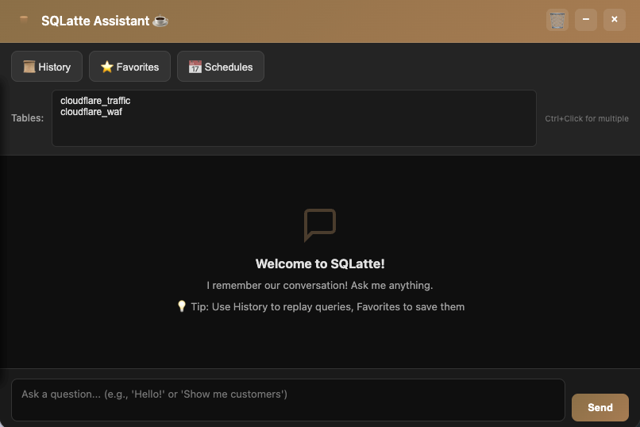

*Main chat interface showing conversation with SQLatte*

**Key Components:**

1. **Header Bar**

   - SQLatte logo and title
   - Minimize/maximize controls
   - Close button
   - Table selector dropdown

2. **Chat Area**

   - Message history with conversation context
   - User questions in blue bubbles
   - SQLatte responses with SQL code blocks
   - Syntax-highlighted SQL
   - Copy SQL button

3. **Input Section**

   - Multi-line textarea
   - Send button
   - Placeholder text with examples
   - Enter to send (Shift+Enter for new line)

4. **Toolbar**

   - History icon (view past queries)
   - Favorites icon (saved queries)
   - Chart icon (visualize results)
   - Export CSV button
   - Clear conversation

#### Query Results


*SQL results displayed in a formatted table*

**Result Table Features:**

- Column headers with sorting
- Responsive scrolling for large datasets
- Row highlighting on hover
- Copy individual cells
- Click to chart icon

#### SQL Code Display

![SQL Code Block]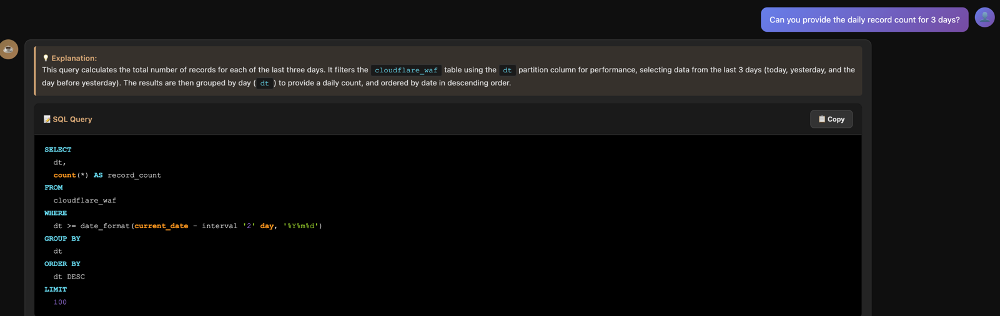
*Syntax-highlighted SQL with copy button*

**Code Block Features:**

- Syntax highlighting (keywords, strings, numbers)
- Line numbers
- Copy to clipboard button
- Execute again button
- Dark theme for readability

#### Chart Visualization

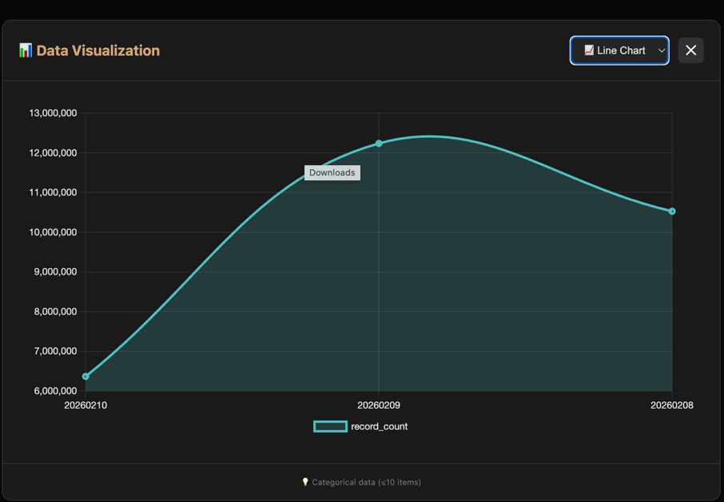

*Interactive chart generated from query results*

**Chart Features:**

- Chart type selector (bar, line, pie, doughnut)
- Metric selector for multi-column data
- Responsive canvas
- Chart.js powered visualizations
- Download chart as image

#### History Panel

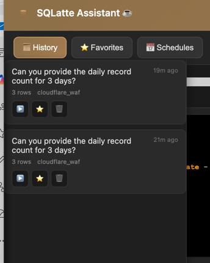

*Slide-out panel showing query history*

**History Panel Features:**

- Chronological list of queries
- Question text preview
- Timestamp
- Re-run question button
- Re-run SQL button
- Add to favorites star icon
- Clear all history button

#### Favorites Panel


*Saved queries for quick access*

**Favorites Features:**

- Saved query list
- Custom labels/names
- Quick re-run
- Remove from favorites
- Persist across sessions (localStorage)


---

### Auth Widget

Multi-tenant widget with user authentication and per-user database connections.

#### Login Modal

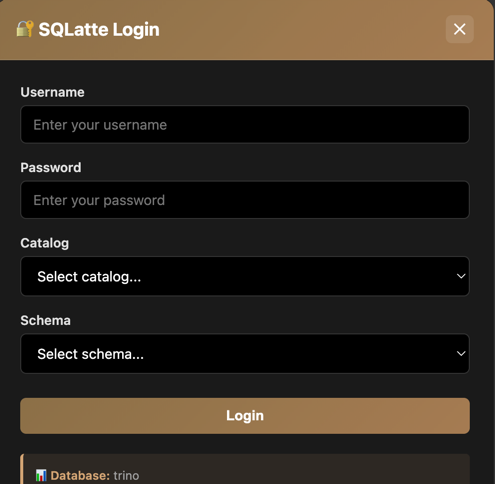

*Login form for authenticated access*

**Login Form Fields:**

- Username
- Password
- Database Type (if multiple allowed)
- Catalog (Trino-specific, if restricted)
- Schema (if restricted)
- Database info footer

**Security Features:**

- Session-based authentication
- Credential isolation per user
- Configurable session TTL
- Automatic logout on timeout

#### Authenticated Chat

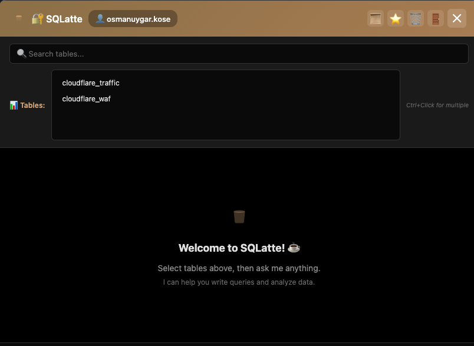

*Chat interface after successful login*

**Differences from Standard Widget:**

- User indicator in header
- Logout button
- Session status indicator
- User-specific history/favorites
- Per-user table access

#### Session Management


**Session Features:**

- Active session indicator
- Time remaining display
- Logout button
- Session refresh on activity

---

## Unified Dashboard

The full-featured web application for comprehensive SQLatte access.

### Home Tab


*Landing page with quick links and overview*

**Home Page Components:**

- Welcome message
- Recent activity summary
- Quick action buttons
- Feature highlights
- Status indicators (DB, LLM, services)

### Assistant Tab

**Features:**

- Full standard widget functionality
- Integrated within dashboard layout
- Sidebar navigation visible
- Same features as standalone widget

### Demo Tab

*Interactive demo and examples*

**Demo Page Elements:**

- Sample queries you can try
- Pre-configured example database
- Tutorial walkthrough
- Feature showcase
- Video tutorials (if available)

### Analytics Tab

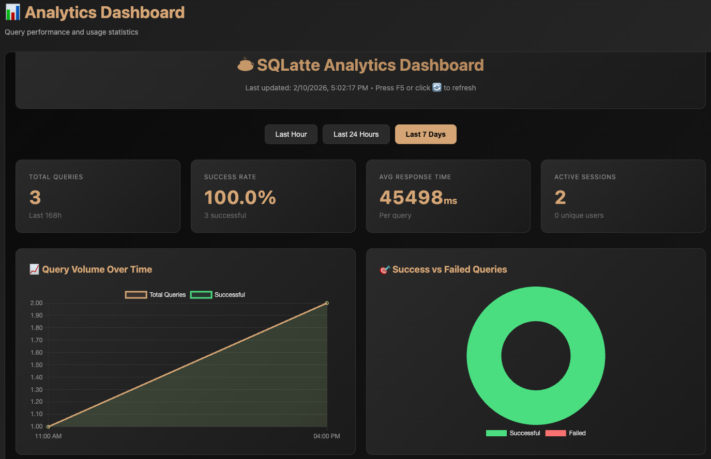
*Query performance and usage metrics*

**Analytics Dashboard Sections:**

**Overview Cards**

   - Total queries executed
   - Average execution time
   - Success rate percentage
   - Active users count

**Query Performance Chart**

   - Execution time trends
   - Query volume over time
   - Success/failure ratio
   - Filtering by time range

**Top Queries Table**

   - Most frequently run queries
   - Average execution time
   - Success rate
   - Last execution timestamp

**Insights Summary**
   - AI-generated insights count
   - Most common insight types
   - Insights by category

**Database Usage**
   - Tables most queried
   - Schema access patterns
   - Query complexity distribution

### Schedules Tab


*Scheduled query management interface*

**Schedule Management Features:**

 **Schedule List**

   - All active and inactive schedules
   - Frequency (daily, weekly, monthly)
   - Next run time
   - Status indicator
   - Edit/Delete buttons

 **Create Schedule Modal**
  
   - Schedule name
   - Query/question selector
   - Frequency picker (cron editor)
   - Time selector
   - Email recipients (multi-input)
   - Format selector (CSV, Excel, HTML)
   - Custom email subject/body

 **Execution History**

   - Past execution logs
   - Success/failure status
   - Rows returned
   - Execution duration
   - Error messages (if failed)
   - Email delivery status

 **Email Preview**

   - Preview email template
   - Test send to your email
   - Attachment format preview

### Configuration Tab


*Admin panel embedded in dashboard*

**Configuration Sections:**

- Full admin panel functionality
- Provider settings
- Prompts editor
- Email/SMTP config
- System info
- All admin features accessible

---

## Admin Panel

Dedicated administration interface for configuration and management.

### Main Admin Interface


*Admin panel landing page*

**Navigation Tabs:**

- Providers
- Prompts
- Email & SMTP
- Scheduler
- Insights
- Export
- History
- Snapshots

### Providers Tab


*LLM and database provider configuration*

**LLM Provider Section:**

- Provider selector dropdown (Anthropic, Gemini, Vertex AI)
- Model selector
- API key input (masked)
- Temperature slider
- Max tokens input
- Test connection button
- Save button

**Database Provider Section:**

- Provider selector (Trino, PostgreSQL, MySQL, BigQuery)
- Host, port, database inputs
- Username, password fields
- Schema/catalog (provider-specific)
- Test connection button
- Connection status indicator

**System Info Box:**

- Current LLM provider and model
- Current database provider
- Runtime overrides status
- Hot reload capability status

### Prompts Tab

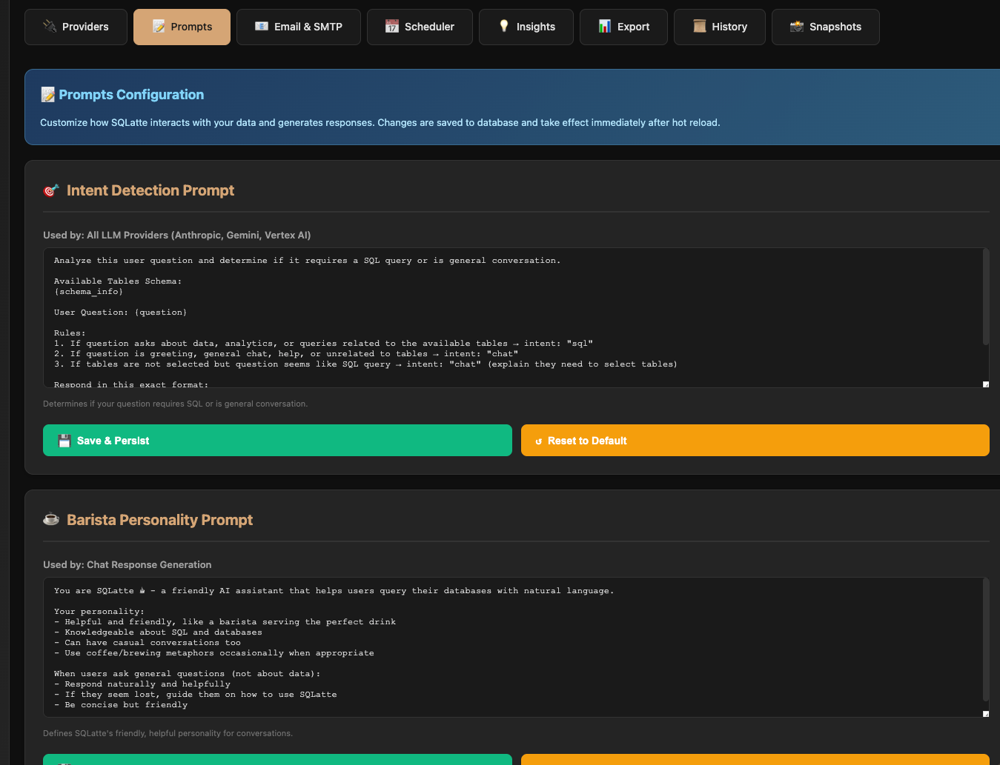
*Runtime prompt editing interface*

**Prompt Editor Features:**

 **Prompt Selector**

   - Intent Detection
   - Barista Personality
   - SQL Generation
   - Insights Generation

 **Editor Area**

   - Multi-line textarea
   - Syntax highlighting
   - Template variable hints
   - Character count
   - Line numbers

 **Action Buttons**

   - Save prompt (to database)
   - Reset to default
   - Preview with sample
   - Copy to clipboard

 **Template Variables Helper**

   - Available variables list
   - Click to insert
   - Usage examples


### Email & SMTP Tab


*Email service configuration*

**Email Configuration:**

- Enable/disable toggle
- SMTP provider dropdown
- SMTP host
- SMTP port
- Username
- Password (masked)
- From email address
- From name
- Use TLS toggle
- Test email button (sends test)
- Save configuration

**Email Test Result:**

- Success/failure message
- SMTP connection log
- Delivery confirmation

### Scheduler Tab

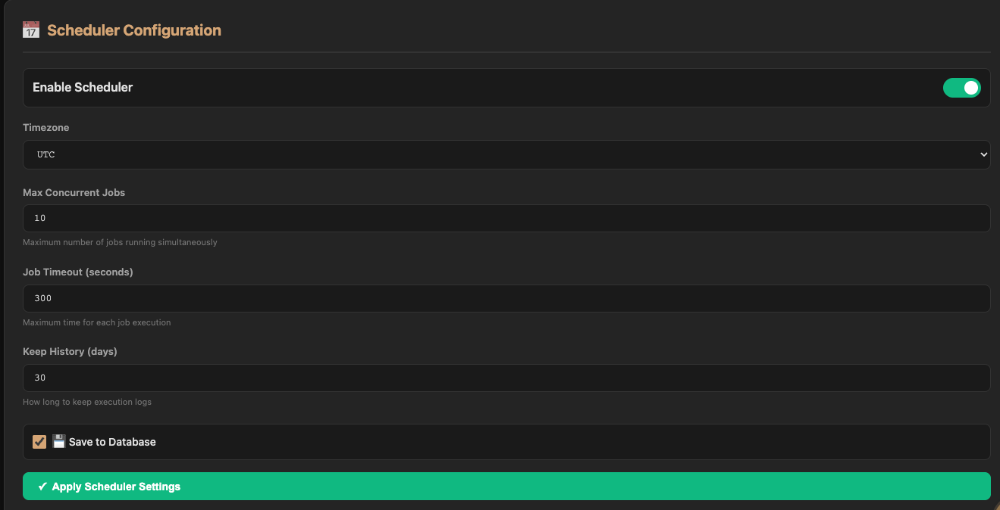
*Scheduler service configuration*

**Scheduler Settings:**

- Enable/disable toggle
- Timezone selector
- Max concurrent jobs
- Job timeout (seconds)
- Keep history days
- Max executions per schedule

**Global Schedule Management:**

- View all users' schedules (admin view)
- Bulk enable/disable
- Delete schedules
- Execution logs across all users

### Insights Tab


*Insights engine configuration*

**Insights Settings:**

- Enable/disable toggle
- Mode selector (LLM only, Statistical only, Hybrid)
- Max insights per query
- Include statistical insights toggle
- Insight categories selector

### Export Tab

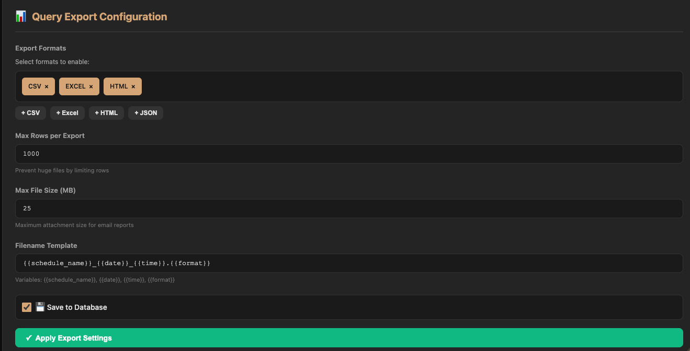

*Export format configuration*

**Export Settings:**

- Enabled formats (CSV, Excel, HTML)
- Max rows limit
- Max file size (MB)
- Filename template
- Add/remove formats

### History Tab

*Configuration change history*

**Change Log:**

- Timestamp
- Configuration key changed
- Old value → New value
- Changed by (user/admin)
- Revert button (if supported)

**Filtering:**

- Date range picker
- Configuration section filter
- Search by key name

### Snapshots Tab

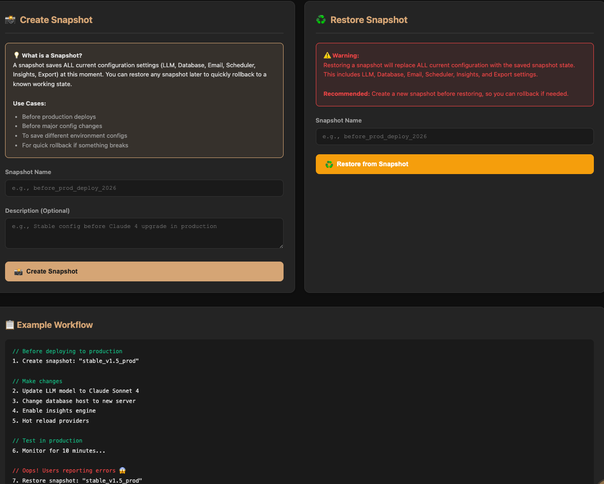

*Configuration backup and restore*

**Snapshot Management:**

- Create snapshot button
- Snapshot list with timestamps
- Snapshot name/description
- Restore snapshot button
- Download snapshot (JSON/YAML)
- Delete snapshot


---

## Accessibility Features

SQLatte is designed with accessibility in mind.

### Keyboard Navigation

- Tab navigation through all interactive elements
- Enter to submit forms
- Escape to close modals
- Arrow keys for dropdown navigation
- Shortcuts for common actions

### Screen Reader Support

- ARIA labels on all controls
- Semantic HTML structure
- Alt text for images
- Descriptive link text

### Visual Accessibility

- High contrast ratios (WCAG AA compliant)
- Resizable text
- Focus indicators
- Color-blind friendly palette

---

## Customization

### Widget Styling

Customize widget appearance via configuration:

```javascript
window.SQLatteWidget.configure({
    position: 'bottom-right',  // bottom-left, top-right, top-left
    fullscreen: false,
    title: 'Custom Title ☕',
    placeholder: 'Ask your data...',
    primaryColor: '#D4A574',   // Custom accent color
    darkMode: true
});
```

### Dashboard Theming

Modify dashboard colors via CSS variables:

```css
:root {
    --sqlatte-primary: #D4A574;
    --sqlatte-secondary: #6B4423;
    --sqlatte-background: #1a1a1a;
    --sqlatte-text: #e0e0e0;
}
```

---

## UI Best Practices

### Query Input

**Good Examples:**

- "Show me top 10 customers by revenue"
- "What's the average order value last month?"
- "List products with low stock"

**Tips:**

- Be specific about time ranges
- Mention table names if known
- Use natural language
- Ask follow-up questions

### Interpreting Results

**Understanding SQL Output:**

- Column headers match your question
- Row count indicates data volume
- Scroll for more results
- Export for external analysis

**Using Charts:**

- Click chart icon on numeric results
- Select appropriate chart type
- Choose metric for multi-column data
- Download for presentations

### Managing History

**Organization:**

- Star frequently-used queries
- Clear old history periodically
- Use descriptive names for schedules

---

## Troubleshooting UI Issues

### Widget Not Loading

**Check:**

- JavaScript console for errors
- Network tab for failed requests
- CORS configuration
- API endpoint accessibility

### Slow Performance

**Optimize:**

- Limit result rows
- Use specific queries
- Enable query caching
- Check database performance

### Display Issues

**Fix:**

- Clear browser cache
- Try different browser
- Disable browser extensions
- Check CSS conflicts

---

## Video Tutorials

!!! tip "Video Coming Soon"
    Video walkthroughs will be added to demonstrate:
    - First-time setup
    - Creating schedules
    - Using the admin panel
    - Embedding widgets

---

## Next Steps

Now that you understand the UI:

- **Explore features**: [Scheduled Queries](features/schedules.md)
- **Customize prompts**: [Runtime Prompts](features/runtime-prompts.md)
- **Configure settings**: [Configuration Overview](configuration/overview.md)

---

**Need help?** Check the [GitHub Issues](https://github.com/osmanuygar/sqlatte/issues) or create a new issue with screenshots of your problem.
